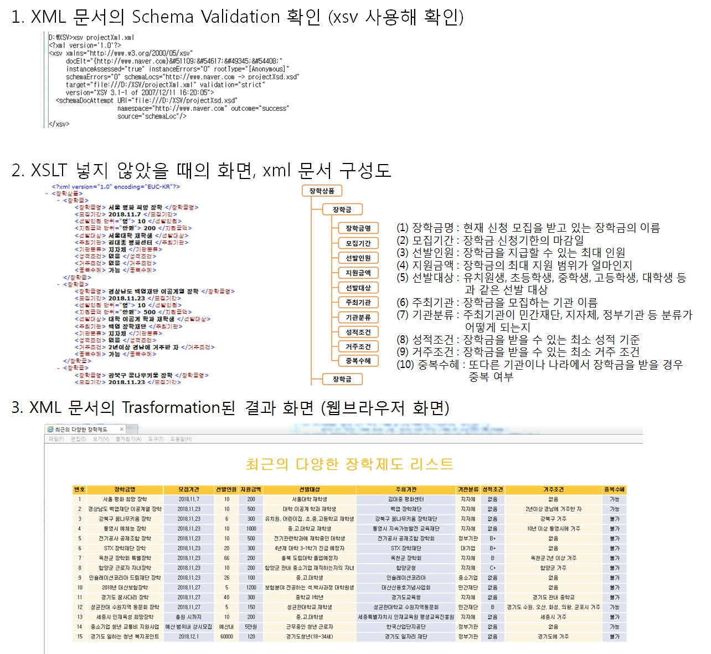

# XmlBoard2018

# 기간
    1개월 (2018-10-26 ~ 2018-11-28)
    
    
# 개요
    XML 프로그래밍에 대한 이해를 위해 XML, XSL, XSD를 사용한 미니 프로젝트입니다.
    최근의 장학제도 정보를 크롤링해 데이터에 대한 스키마 정의, 데이터 저장, 데이터 표현을 시각적으로 구성했습니다.
    

# 사용한 라이브러리 및 구현 환경
    1) 구현 환경
        - Window 7
        - xml
	
    2) 사용한 라이브러리 및 기능
        - css를 사용한 UI 구현
    
    
    
# 필요 기능과 과정
    1. xsd 파일 : 스키마 정의
    2. xml 파일 : 스키마를 활용해 데이터 저장
    3. xsl 파일 : xml 파일의 내용을 받아와 스타일을 적용

# 구현 화면

# 주요 소스코드 설명
    1. projectXsd.xsd
        * 데이터에 대한 스키마를 정의한 파일
        - 스키마 : 장학상품을 root element로 함
        - 장학상품 내에는 장학금 요소가 여러 번 나올 수 있다.
        - 장학금 요소에는 장학금명, 모집기간, 선발인원, 지원금액, 선발대상, 주최기관, 
	        기관분류, 성적조건, 중복수혜의 10개 요소가 한번씩 나와야 한다.
        - 각 요소는 string의 값을 값으로 취한다.
        
    2. projectXml.xml
        * 데이터를 xml로 표현한 파일(스키마에 맞게 데이터 저장)
        - projectXsd.xsd 스키마를 사용한다.
        - projectXsl.xsl XSLT 문서를 사용한다.
        - 각 장학금 요소에 대한 값을 15개 넣는다.
        
    3. projectXsl.xsl
        * 데이터를 표현할때 스타일을 정해주는 파일
        - xsd의 namespace를 지정하고, 접근할 때 namespace를 사용한다.
        - 표를 보기 좋게 색을 바꿔준다.
        - 모집기간을 기준으로 descending sort를 해준다.
